# DESAFIO 1 (UEFI y coreboot):

1) UEFI significa "Unified Extensible Firmware Interface" en inglés. Es un estándar de firmware que reemplaza al BIOS tradicional en muchas computadoras modernas, brindando una interfaz entre el sistema operativo y el hardware para permitir un arranque más rápido y seguro, así como una mayor flexibilidad en la configuración del sistema. Para usar UEFI, generalmente se accede a la configuración del firmware durante el arranque de la computadora, mediante la presión de una tecla específica (como F2, F10, o Del). Desde la configuración UEFI, es posible ajustar diversas opciones relacionadas con el arranque, el hardware y otras configuraciones del sistema. Una función específica que se puede llamar utilizando la dinámica de UEFI es la de configurar el orden de arranque de los dispositivos, útil para cambiar entre sistemas operativos o iniciar desde un dispositivo externo como una unidad USB

2) 
- BlackLotus es el primer malware conocido que puede secuestrar el proceso de arranque de una computadora incluso cuando Secure Boot y otras protecciones avanzadas están habilitadas y se ejecutan en versiones completamente actualizadas de Windows. Es un bootkit UEFI, lo que significa que apunta al UEFI. El peligro de este malware radica en su capacidad para secuestrar el proceso de arranque de una computadora, lo que le permite tomar el control del sistema antes de que se cargue el sistema operativo. Esto significa que puede evadir la mayoría de las medidas de seguridad del sistema operativo, ya que se carga antes de que estas medidas de seguridad estén en su lugar.
Además, BlackLotus es capaz de persistir en el sistema incluso después de que se hayan tomado medidas para eliminarlo, como reinstalar el sistema operativo o reemplazar el disco duro. Esto se debe a que se instala en el firmware UEFI, que no se ve afectado por estas medidas.

- HP anunció la liberación de parches para dos vulnerabilidades de alta gravedad que afectan el firmware UEFI de más de 200 laptops, estaciones de trabajo y otros productos. Las vulnerabilidades, identificadas como CVE-2021-3808 y CVE-2021-3809, podrían permitir la ejecución de código arbitrario en sistemas que ejecutan versiones anteriores del firmware UEFI32.
Estas vulnerabilidades fueron identificadas en ciertos productos de PC de HP que utilizan el firmware AMI UEFI (BIOS del sistema), que podrían permitir la ejecución de código arbitrario. AMI ha lanzado actualizaciones para mitigar las posibles vulnerabilidades1.
Las vulnerabilidades fueron reportadas por TianoCore.org y tienen una puntuación de gravedad de 7.0 según el sistema de puntuación CVSS 3.11. Los identificadores de las vulnerabilidades son CVE-2022-36763, CVE-2022-36764 y CVE-2022-367651.
HP ha identificado las plataformas afectadas y los correspondientes SoftPaqs con versiones mínimas que mitigan las posibles vulnerabilidades. HP recomienda mantener su sistema actualizado con el último firmware y software

3) 
- La Converged Security and Management Engine (CSME) es una tecnología de seguridad y gestión desarrollada por Intel que se encuentra integrada en muchos de sus procesadores, actuando de forma aislada de la CPU. CSME opera en un nivel muy bajo del sistema, incluso por debajo del sistema operativo, y tiene varias funciones importantes:
    - Seguridad: CSME proporciona características de seguridad críticas, como el arranque seguro (Secure Boot), el almacenamiento seguro de claves criptográficas y la protección de la integridad del sistema.
    - Administración Remota: A través de la Converged Security and Management Engine, los administradores de sistemas pueden realizar tareas de gestión remota, como diagnósticos, configuración y actualizaciones de firmware, incluso cuando el sistema operativo principal no está operativo o no está accesible.
    - Gestión de Energía: CSME también desempeña un papel en la gestión eficiente de la energía, ayudando a optimizar el consumo de energía y el rendimiento del sistema.

- El Intel Management Engine BIOS Extension (Intel MEBx), por otro lado, es una extensión del BIOS (Basic Input/Output System)  que integra Intel para la gestión remota y la seguridad en sus procesadores.
    - Configuración Avanzada en la BIOS:
    Intel MEBx proporciona una interfaz gráfica o de texto dentro de la BIOS de la computadora. Esto permite a los administradores de sistemas acceder a configuraciones avanzadas relacionadas con la Intel Management Engine (ME).
    Estas configuraciones incluyen ajustes de seguridad, gestión remota, redes y opciones de energía. Por ejemplo, se puede establecer una contraseña para acceder a la MEBx, configurar la dirección IP para la gestión remota o habilitar funciones como Intel Active Management Technology (AMT) para el control remoto completo del sistema.
    - Gestión Remota y Diagnósticos:
    A través de Intel MEBx, los administradores pueden diagnosticar problemas de hardware o software, incluso cuando el sistema operativo principal no está disponible o no puede arrancar.
    Permite la gestión remota de sistemas, lo que es especialmente útil en entornos empresariales donde se necesitan capacidades de mantenimiento y soporte a distancia.
    - Control de Seguridad:
    MEBx también juega un papel crucial en la seguridad del sistema al permitir la configuración de políticas de seguridad avanzadas. Esto incluye la gestión de certificados digitales, el establecimiento de reglas de autenticación y la configuración de permisos de acceso remoto.
    La capacidad de controlar la MEBx desde la BIOS agrega una capa adicional de seguridad al sistema al proporcionar opciones para proteger la gestión remota y los datos confidenciales almacenados en la Intel Management Engine.

4) Coreboot, anteriormente conocido como LinuxBIOS, es un proyecto de software destinado a reemplazar el firmware propietario (BIOS o UEFI) que se encuentra en la mayoría de los ordenadores. Está diseñado para ser un firmware ligero que realiza solo el número mínimo de tareas necesarias para cargar y ejecutar un sistema operativo moderno de 32 o 64 bits12.
El objetivo de Coreboot es ofrecer las funciones más elementales al inicio del sistema para luego pasar a inicializar el hardware. Después de esta inicialización, comienza la secuencia de arranque del sistema operativo.
Esencialmente, Coreboot es una iniciativa destinada a «abrir» y simplificar el nivel de firmware de los ordenadores modernos. Aunque la mayor parte del software de Coreboot es libre, se requieren blobs binarios para que funcione en algunos dispositivos de hardware. Libreboot es una versión de Coreboot que está completamente libre de blobs y, por tanto, es 100% software libre.
Coreboot es respaldado por la Free Software Foundation (FSF) y su existencia no se basa en una necesidad tecnológica, sino en una ética, ya que para los miembros de la FSF es importante que todo el software del PC sea libre

Algunos de los productos que incorporan coreboot son:
- System76: Esta compañía ha decidido tener un catálogo de portátiles profesionales muy atractivos y potentes para los usuarios profesionales de GNU/Linux. El nuevo Oryx Pro de System76 es el primer portátil que combina Coreboot y NVIDIA1. Este portátil incluye un procesador Intel Core i7-10875H con 8 núcleos físicos, 16 hilos, 2,3GHz de frecuencia base y 5,1GHz de velocidad en modo turbo.

- Fabricantes de placas base: Algunos fabricantes de placas base como MSI, Gigabyte y Tyan han ofrecido Coreboot junto al BIOS propietario estándar o han proporcionado las especificaciones de las interfaces del hardware para algunas de sus placas base recientes.

- Google Chromebooks: Muchos Chromebooks utilizan Coreboot como firmware base debido a su enfoque en la seguridad, la rapidez de arranque y la flexibilidad. 

# Codigo Helloworld:

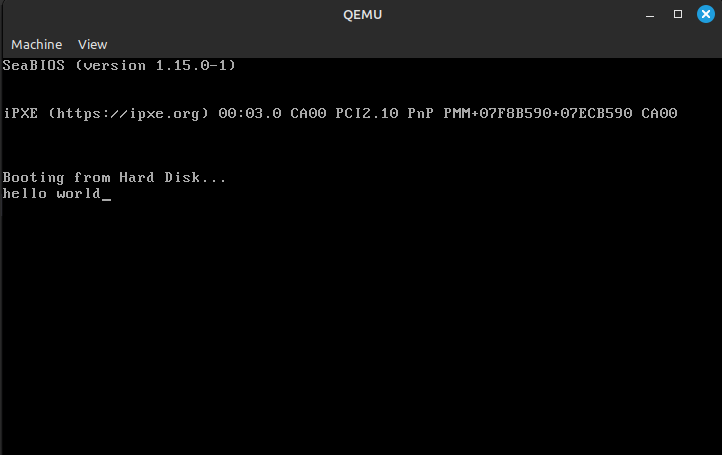

# DESAFIO 2 (Linker):

1) El linker es una parte crucial en el proceso de desarrollo de software, especialmente en lenguajes compilados (como C/C++ y assembler). Su función más importante es la de tomar varios archivos object generados por un compilador y combinarlos en un solo archivo ejecutable o librería.

2) La dirección que aparece en el script del linker, en este caso . = 0x7c00;, es una directiva que indica al linker dónde debe colocar el código en el archivo binario resultante. En el contexto de un bootloader o un programa que se carga directamente desde el sector de arranque de un disco, esta dirección es crucial porque representa la ubicación física en la memoria donde el BIOS carga el código durante el proceso de arranque.

- Dirección de Carga del Bootloader:
    Cuando el BIOS carga un programa desde el disco al iniciar la computadora, lo hace cargando el primer sector del disco en una dirección específica en la memoria. Esta dirección suele ser 0x7C00 para los sistemas x86/x86_64.
    La directiva . = 0x7C00; en el script del linker le dice al linker que el código generado debe ser colocado en la dirección 0x7C00 del archivo binario resultante. Esto asegura que el código esté ubicado en el mismo lugar donde el BIOS lo cargará durante el arranque.
- Cálculo de Direcciones de Símbolos:
    Al especificar esta dirección al linker, también permite que el linker calcule correctamente las direcciones de los símbolos y etiquetas dentro del código. Por ejemplo, si defines un punto de entrada llamado __start en la dirección 0x7C00, el linker sabe que cuando se llama a __start desde otra parte del código, debe generar una instrucción de salto (jmp) a 0x7C00.
- Magic Boot Bytes:
    En el código, después de la sección .text, hay una línea que coloca los "magic boot bytes" al final del primer sector (0x1FE es la posición justo antes del último byte del sector). Estos bytes (0xAA55) son una firma especial que el BIOS busca para identificar que el sector de arranque contiene un programa válido para iniciar el sistema.

## Salida hd: 
´´´ bash
00000000  7f 45 4c 46 02 01 01 00  00 00 00 00 00 00 00 00  |.ELF............|
00000010  01 00 3e 00 01 00 00 00  00 00 00 00 00 00 00 00  |..>.............|
00000020  00 00 00 00 00 00 00 00  d8 03 00 00 00 00 00 00  |................|
00000030  00 00 00 00 40 00 00 00  00 00 40 00 10 00 0f 00  |....@.....@.....|
00000040  be 00 00 b4 0e ac 08 c0  74 04 cd 10 eb f7 f4 68  |........t......h|
00000050  65 6c 6c 6f 20 77 6f 72  6c 64 00 3b 00 00 00 03  |ello world.;....|
00000060  00 1d 00 00 00 01 01 fb  0e 0d 00 01 01 01 01 00  |................|
00000070  00 00 01 00 00 01 00 6d  61 69 6e 2e 53 00 00 00  |.......main.S...|
00000080  00 00 00 09 02 00 00 00  00 00 00 00 00 13 3d 30  |..............=0|
00000090  21 2f 2f 2f 30 02 0d 00  01 01 2a 00 00 00 02 00  |!///0.....*.....|
000000a0  00 00 00 00 08 01 00 00  00 00 00 00 00 00 00 00  |................|
000000b0  00 00 00 00 00 00 00 00  00 00 00 00 00 00 00 00  |................|
000000c0  00 00 00 00 00 00 01 80  01 11 00 10 06 11 01 12  |................|
000000d0  01 03 0e 1b 0e 25 0e 13  05 00 00 00 00 00 00 00  |.....%..........|
000000e0  2c 00 00 00 02 00 00 00  00 00 08 00 00 00 00 00  |,...............|
000000f0  00 00 00 00 00 00 00 00  1b 00 00 00 00 00 00 00  |................|
00000100  00 00 00 00 00 00 00 00  00 00 00 00 00 00 00 00  |................|
00000110  6d 61 69 6e 2e 53 00 2f  68 6f 6d 65 2f 6a 6f 61  |main.S./home/joa|
00000120  71 75 69 6e 2f 46 61 63  75 2f 54 50 33 5f 53 49  |quin/Facu/TP3_SI|
00000130  53 54 43 4f 4d 50 2f 70  72 6f 74 65 63 74 65 64  |STCOMP/protected|
00000140  2d 6d 6f 64 65 2d 73 64  63 2f 30 31 48 65 6c 6c  |-mode-sdc/01Hell|
00000150  6f 57 6f 72 6c 64 00 47  4e 55 20 41 53 20 32 2e  |oWorld.GNU AS 2.|
00000160  33 38 00 00 00 00 00 00  00 00 00 00 00 00 00 00  |38..............|
00000170  00 00 00 00 00 00 00 00  00 00 00 00 00 00 00 00  |................|
00000180  00 00 00 00 03 00 01 00  00 00 00 00 00 00 00 00  |................|
00000190  00 00 00 00 00 00 00 00  01 00 00 00 00 00 01 00  |................|
000001a0  0f 00 00 00 00 00 00 00  00 00 00 00 00 00 00 00  |................|
000001b0  05 00 00 00 00 00 01 00  05 00 00 00 00 00 00 00  |................|
000001c0  00 00 00 00 00 00 00 00  0a 00 00 00 00 00 01 00  |................|
000001d0  0e 00 00 00 00 00 00 00  00 00 00 00 00 00 00 00  |................|
000001e0  00 00 00 00 03 00 07 00  00 00 00 00 00 00 00 00  |................|
000001f0  00 00 00 00 00 00 00 00  00 00 00 00 03 00 09 00  |................|
00000200  00 00 00 00 00 00 00 00  00 00 00 00 00 00 00 00  |................|
00000210  00 00 00 00 03 00 05 00  00 00 00 00 00 00 00 00  |................|
00000220  00 00 00 00 00 00 00 00  00 00 00 00 03 00 0c 00  |................|
00000230  00 00 00 00 00 00 00 00  00 00 00 00 00 00 00 00  |................|
00000240  00 6d 73 67 00 6c 6f 6f  70 00 68 61 6c 74 00 00  |.msg.loop.halt..|
00000250  01 00 00 00 00 00 00 00  0c 00 00 00 01 00 00 00  |................|
00000260  0f 00 00 00 00 00 00 00  2a 00 00 00 00 00 00 00  |........*.......|
00000270  01 00 00 00 01 00 00 00  00 00 00 00 00 00 00 00  |................|
00000280  06 00 00 00 00 00 00 00  0a 00 00 00 06 00 00 00  |................|
00000290  00 00 00 00 00 00 00 00  0c 00 00 00 00 00 00 00  |................|
000002a0  0a 00 00 00 07 00 00 00  00 00 00 00 00 00 00 00  |................|
000002b0  10 00 00 00 00 00 00 00  01 00 00 00 01 00 00 00  |................|
000002c0  00 00 00 00 00 00 00 00  18 00 00 00 00 00 00 00  |................|
000002d0  01 00 00 00 01 00 00 00  1b 00 00 00 00 00 00 00  |................|
000002e0  20 00 00 00 00 00 00 00  0a 00 00 00 08 00 00 00  | ...............|
000002f0  00 00 00 00 00 00 00 00  24 00 00 00 00 00 00 00  |........$.......|
00000300  0a 00 00 00 08 00 00 00  07 00 00 00 00 00 00 00  |................|
00000310  28 00 00 00 00 00 00 00  0a 00 00 00 08 00 00 00  |(...............|
00000320  47 00 00 00 00 00 00 00  06 00 00 00 00 00 00 00  |G...............|
00000330  0a 00 00 00 05 00 00 00  00 00 00 00 00 00 00 00  |................|
00000340  10 00 00 00 00 00 00 00  01 00 00 00 01 00 00 00  |................|
00000350  00 00 00 00 00 00 00 00  00 2e 73 79 6d 74 61 62  |..........symtab|
00000360  00 2e 73 74 72 74 61 62  00 2e 73 68 73 74 72 74  |..strtab..shstrt|
00000370  61 62 00 2e 72 65 6c 61  2e 74 65 78 74 00 2e 64  |ab..rela.text..d|
00000380  61 74 61 00 2e 62 73 73  00 2e 72 65 6c 61 2e 64  |ata..bss..rela.d|
00000390  65 62 75 67 5f 6c 69 6e  65 00 2e 72 65 6c 61 2e  |ebug_line..rela.|
000003a0  64 65 62 75 67 5f 69 6e  66 6f 00 2e 64 65 62 75  |debug_info..debu|
000003b0  67 5f 61 62 62 72 65 76  00 2e 72 65 6c 61 2e 64  |g_abbrev..rela.d|
000003c0  65 62 75 67 5f 61 72 61  6e 67 65 73 00 2e 64 65  |ebug_aranges..de|
000003d0  62 75 67 5f 73 74 72 00  00 00 00 00 00 00 00 00  |bug_str.........|
000003e0  00 00 00 00 00 00 00 00  00 00 00 00 00 00 00 00  |................|
*
00000410  00 00 00 00 00 00 00 00  20 00 00 00 01 00 00 00  |........ .......|
00000420  06 00 00 00 00 00 00 00  00 00 00 00 00 00 00 00  |................|
00000430  40 00 00 00 00 00 00 00  1b 00 00 00 00 00 00 00  |@...............|
00000440  00 00 00 00 00 00 00 00  01 00 00 00 00 00 00 00  |................|
00000450  00 00 00 00 00 00 00 00  1b 00 00 00 04 00 00 00  |................|
00000460  40 00 00 00 00 00 00 00  00 00 00 00 00 00 00 00  |@...............|
00000470  50 02 00 00 00 00 00 00  18 00 00 00 00 00 00 00  |P...............|
00000480  0d 00 00 00 01 00 00 00  08 00 00 00 00 00 00 00  |................|
00000490  18 00 00 00 00 00 00 00  26 00 00 00 01 00 00 00  |........&.......|
000004a0  03 00 00 00 00 00 00 00  00 00 00 00 00 00 00 00  |................|
000004b0  5b 00 00 00 00 00 00 00  00 00 00 00 00 00 00 00  |[...............|
000004c0  00 00 00 00 00 00 00 00  01 00 00 00 00 00 00 00  |................|
000004d0  00 00 00 00 00 00 00 00  2c 00 00 00 08 00 00 00  |........,.......|
000004e0  03 00 00 00 00 00 00 00  00 00 00 00 00 00 00 00  |................|
000004f0  5b 00 00 00 00 00 00 00  00 00 00 00 00 00 00 00  |[...............|
00000500  00 00 00 00 00 00 00 00  01 00 00 00 00 00 00 00  |................|
00000510  00 00 00 00 00 00 00 00  36 00 00 00 01 00 00 00  |........6.......|
00000520  00 00 00 00 00 00 00 00  00 00 00 00 00 00 00 00  |................|
00000530  5b 00 00 00 00 00 00 00  3f 00 00 00 00 00 00 00  |[.......?.......|
00000540  00 00 00 00 00 00 00 00  01 00 00 00 00 00 00 00  |................|
00000550  00 00 00 00 00 00 00 00  31 00 00 00 04 00 00 00  |........1.......|
00000560  40 00 00 00 00 00 00 00  00 00 00 00 00 00 00 00  |@...............|
00000570  68 02 00 00 00 00 00 00  18 00 00 00 00 00 00 00  |h...............|
00000580  0d 00 00 00 05 00 00 00  08 00 00 00 00 00 00 00  |................|
00000590  18 00 00 00 00 00 00 00  47 00 00 00 01 00 00 00  |........G.......|
000005a0  00 00 00 00 00 00 00 00  00 00 00 00 00 00 00 00  |................|
000005b0  9a 00 00 00 00 00 00 00  2e 00 00 00 00 00 00 00  |................|
000005c0  00 00 00 00 00 00 00 00  01 00 00 00 00 00 00 00  |................|
000005d0  00 00 00 00 00 00 00 00  42 00 00 00 04 00 00 00  |........B.......|
000005e0  40 00 00 00 00 00 00 00  00 00 00 00 00 00 00 00  |@...............|
000005f0  80 02 00 00 00 00 00 00  a8 00 00 00 00 00 00 00  |................|
00000600  0d 00 00 00 07 00 00 00  08 00 00 00 00 00 00 00  |................|
00000610  18 00 00 00 00 00 00 00  53 00 00 00 01 00 00 00  |........S.......|
00000620  00 00 00 00 00 00 00 00  00 00 00 00 00 00 00 00  |................|
00000630  c8 00 00 00 00 00 00 00  14 00 00 00 00 00 00 00  |................|
00000640  00 00 00 00 00 00 00 00  01 00 00 00 00 00 00 00  |................|
00000650  00 00 00 00 00 00 00 00  66 00 00 00 01 00 00 00  |........f.......|
00000660  00 00 00 00 00 00 00 00  00 00 00 00 00 00 00 00  |................|
00000670  e0 00 00 00 00 00 00 00  30 00 00 00 00 00 00 00  |........0.......|
00000680  00 00 00 00 00 00 00 00  10 00 00 00 00 00 00 00  |................|
00000690  00 00 00 00 00 00 00 00  61 00 00 00 04 00 00 00  |........a.......|
000006a0  40 00 00 00 00 00 00 00  00 00 00 00 00 00 00 00  |@...............|
000006b0  28 03 00 00 00 00 00 00  30 00 00 00 00 00 00 00  |(.......0.......|
000006c0  0d 00 00 00 0a 00 00 00  08 00 00 00 00 00 00 00  |................|
000006d0  18 00 00 00 00 00 00 00  75 00 00 00 01 00 00 00  |........u.......|
000006e0  30 00 00 00 00 00 00 00  00 00 00 00 00 00 00 00  |0...............|
000006f0  10 01 00 00 00 00 00 00  53 00 00 00 00 00 00 00  |........S.......|
00000700  00 00 00 00 00 00 00 00  01 00 00 00 00 00 00 00  |................|
00000710  01 00 00 00 00 00 00 00  01 00 00 00 02 00 00 00  |................|
00000720  00 00 00 00 00 00 00 00  00 00 00 00 00 00 00 00  |................|
00000730  68 01 00 00 00 00 00 00  d8 00 00 00 00 00 00 00  |h...............|
00000740  0e 00 00 00 09 00 00 00  08 00 00 00 00 00 00 00  |................|
00000750  18 00 00 00 00 00 00 00  09 00 00 00 03 00 00 00  |................|
00000760  00 00 00 00 00 00 00 00  00 00 00 00 00 00 00 00  |................|
00000770  40 02 00 00 00 00 00 00  0f 00 00 00 00 00 00 00  |@...............|
00000780  00 00 00 00 00 00 00 00  01 00 00 00 00 00 00 00  |................|
00000790  00 00 00 00 00 00 00 00  11 00 00 00 03 00 00 00  |................|
000007a0  00 00 00 00 00 00 00 00  00 00 00 00 00 00 00 00  |................|
000007b0  58 03 00 00 00 00 00 00  80 00 00 00 00 00 00 00  |X...............|
000007c0  00 00 00 00 00 00 00 00  01 00 00 00 00 00 00 00  |................|
000007d0  00 00 00 00 00 00 00 00                           |........|
000007d8
´´´
## Salida objdump -s :
´´´ bash
main.o:     formato del fichero elf64-x86-64

Contenido de la sección .text:
 0000 be0000b4 0eac08c0 7404cd10 ebf7f468  ........t......h
 0010 656c6c6f 20776f72 6c6400             ello world.     
Contenido de la sección .debug_line:
 0000 3b000000 03001d00 00000101 fb0e0d00  ;...............
 0010 01010101 00000001 00000100 6d61696e  ............main
 0020 2e530000 00000000 09020000 00000000  .S..............
 0030 0000133d 30212f2f 2f30020d 000101    ...=0!///0..... 
Contenido de la sección .debug_info:
 0000 2a000000 02000000 00000801 00000000  *...............
 0010 00000000 00000000 00000000 00000000  ................
 0020 00000000 00000000 00000000 0180      ..............  
Contenido de la sección .debug_abbrev:
 0000 01110010 06110112 01030e1b 0e250e13  .............%..
 0010 05000000                             ....            
Contenido de la sección .debug_aranges:
 0000 2c000000 02000000 00000800 00000000  ,...............
 0010 00000000 00000000 1b000000 00000000  ................
 0020 00000000 00000000 00000000 00000000  ................
Contenido de la sección .debug_str:
 0000 6d61696e 2e53002f 686f6d65 2f6a6f61  main.S./home/joa
 0010 7175696e 2f466163 752f5450 335f5349  quin/Facu/TP3_SI
 0020 5354434f 4d502f70 726f7465 63746564  STCOMP/protected
 0030 2d6d6f64 652d7364 632f3031 48656c6c  -mode-sdc/01Hell
 0040 6f576f72 6c640047 4e552041 5320322e  oWorld.GNU AS 2.
 0050 333800                               38.       
 ´´´

4) El resultado no fue el esperado, en clase consultaremos el motivo:
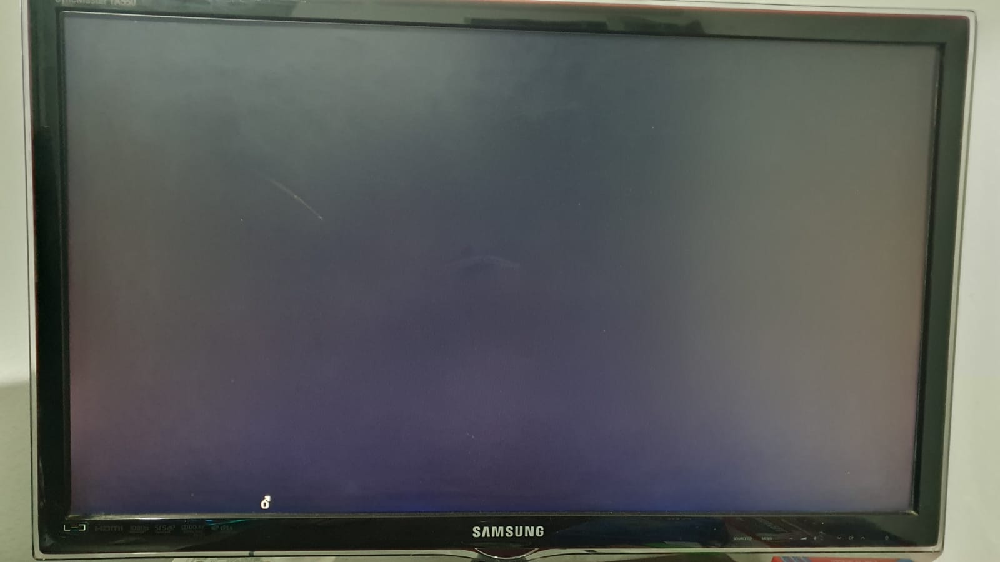

5) La opción --oformat binary en el linker se utiliza para especificar el formato de salida del archivo enlazado. Cuando usas esta opción, el enlazador genera un archivo binario como salida, en lugar del formato de salida predeterminado, que podría ser un archivo ejecutable en un formato específico como ELF (Formato Ejecutable y Enlazable) o COFF (Formato Común de Archivo Objeto).

En el contexto de la creación de bootloaders o firmware de bajo nivel, generar una salida binaria es común porque el archivo resultante puede ser escrito directamente en un dispositivo de almacenamiento (como un disco o memoria flash) sin ningún formato adicional o encabezados. Este archivo binario típicamente comienza con las instrucciones de código de máquina reales y no contiene información de metadatos o encabezados.

6) Depuracion:

- Break direccion de arranque:
 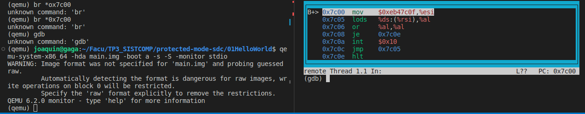
- Break call interrupcion:
 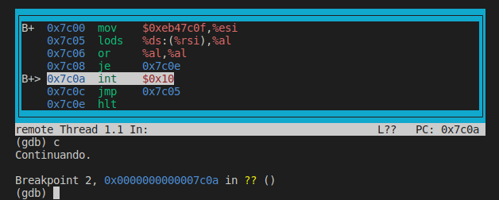
- Una instruccion despues:

 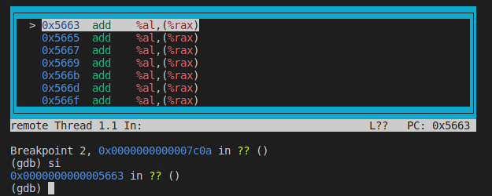
- Un c y otra instruccion despues:
 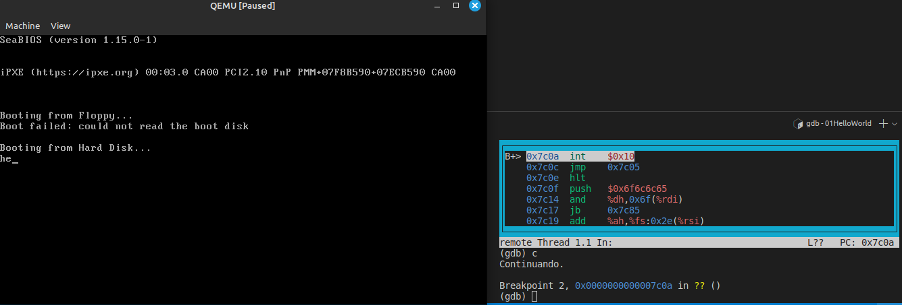
- Otra vez, podemos observar como cada interrupcion agrega un char a la pantalla:
 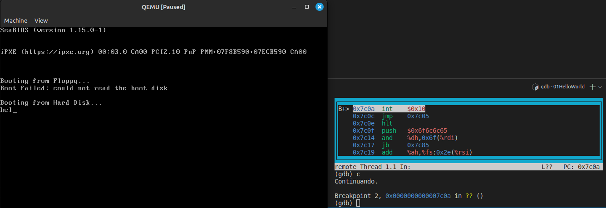
- Llegamos al final, veamos linea a linea:
 
 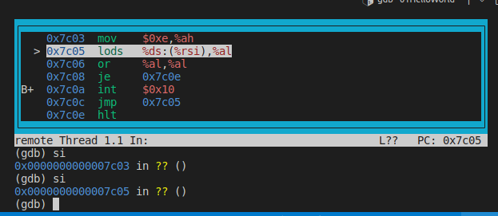 
 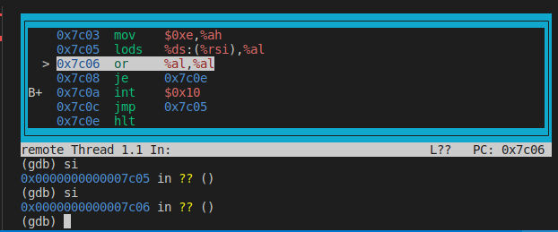
 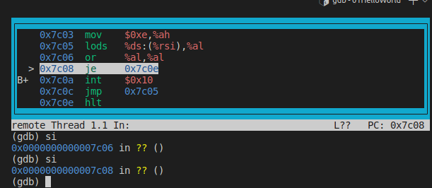
 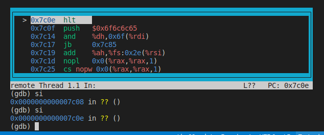

## Desafío final

### Código para pasar de modo real a modo protegido

```c
.equ CODE_SEG, gdt_code - gdt_start
.equ DATA_SEG_RW, gdt_data_rw - gdt_start

.code16

protected_mode_start:
   cli
   lgdt gdt_descriptor

   /* Configurar el manejador de interrupciones para la excepción GPF */
   lidt idt_descriptor

   mov %cr0, %eax
   orl $0x1, %eax
   mov %eax, %cr0 

   ljmp $CODE_SEG, $protected_mode

gdt_start:
    gdt_null:
        .long 0x0
        .long 0x0
    gdt_code:
        .word 0xffff
        .word 0x0
        .byte 0x0
        .byte 0b10011010
        .byte 0b11001111
        .byte 0x0
    gdt_data_rw:
        .word 0xffff
        .word 0x0
        .byte 0x0
        .byte 0b10010000 /* lectura/escritura */
        .byte 0b11001111
        .byte 0x0
gdt_end:

gdt_descriptor:
    .word gdt_end - gdt_start
    .long gdt_start

/* Tabla de Descriptores de Interrupción (IDT) */
idt_start:
    /* Rellenar las primeras 12 entradas con un manejador de interrupciones genérico o vacío */
    .rept 0x0D
        .quad 0
    .endr

    /* Entrada para la excepción GPF (interrupción 13) */
    .word gpf_handler
    .word CODE_SEG
    .byte 0
    .byte 0b10001110
    .word 0
idt_end:

idt_descriptor:
    .word idt_end - idt_start
    .long idt_start


.code32
protected_mode:

    call print_message

    mov $DATA_SEG_RW, %ax /*cargamos en ax el valor de DATA_SEG y se lo cargamos a todos los registros de segmentos */
    mov %ax, %ds
    mov %ax, %es
    mov %ax, %fs
    mov %ax, %gs
    mov %ax, %ss

looop:
    jmp looop

/* Manejador de interrupciones para la excepción GPF */
gpf_handler:
    pusha
    mov $gpf_message, %ecx
    call print_message_gpf
    popa
    jmp looop
    

/* Print message on VGA */
print_message:
    mov $message, %ecx                  /* Load the address of the message into ECX */
    mov vga, %eax                       /* Load the address of the VGA buffer into EAX */
    
    /* Calculate VGA memory address */
    mov $160, %edx
    mul %edx
    lea 0xb8000(%eax), %edx
    mov $0x0f, %ah 
lup:
    mov (%ecx), %al                     /* Load the character from the message into AL */
    cmp $0, %al                         /* Check for the end of the message */
    je thiistheend
    
    mov %ax, (%edx)                     /* Write the character to the VGA buffer */
    
    /* Move to the next character in the message and VGA buffer */
    add $1, %ecx
    add $2, %edx
    jmp lup
thiistheend:
    ret

/* Print message on VGA */
print_message_gpf:
    mov $gpf_message, %ecx                  /* Load the address of the message into ECX */
    mov vga, %eax                           /* Load the address of the VGA buffer into EAX */
    
    /* Calculate VGA memory address */
    mov $160, %edx
    mul %edx
    add $160, %eax                          /* Move to the next line */
    lea 0xb8000(%eax), %edx
    mov $0x0f, %ah 
loop:
    mov (%ecx), %al                         /* Load the character from the message into AL */
    cmp $0, %al                             /* Check for the end of the message */
    je end
    
    mov %ax, (%edx)                         /* Write the character to the VGA buffer */
    
    /* Move to the next character in the message and VGA buffer */
    add $1, %ecx
    add $2, %edx
    jmp loop
end:
    ret

/* Clear VGA memory */
clear_vga:
    mov $0xb8000, %edi /* Start of VGA memory */
    mov $0x0f20, %ax   /* Attribute byte (0x0f) followed by space character (0x20) */
    mov $4000, %ecx    /* VGA memory is 4000 words long */
    rep stosw          /* Repeat STOSW ECX times */
    ret


/* Message to be printed on VGA */
message:
    .asciz "P-mode"

/* Mensaje a imprimir cuando se produce una excepción GPF */
gpf_message:
    .asciz "GPF"
    
/* VGA buffer address */
vga:
    .long 10
           
```

Este código es un programa de arranque en lenguaje ensamblador para una arquitectura x86 que cambia de modo real a modo protegido. Comienza definiendo los desplazamientos de los segmentos de código y datos en la Tabla Global de Descriptores (GDT) con las etiquetas `CODE_SEG` y `DATA_SEG_RW`. Luego, en modo real, deshabilita las interrupciones, carga la dirección de la GDT en el registro GDTR y configura el manejador de interrupciones para la excepción de Fallo General de Protección (GPF). 

Posteriormente, activa el bit de modo protegido en el registro de control CR0 y realiza un salto largo a la etiqueta `protected_mode` en el segmento de código, cambiando efectivamente a modo protegido. Define la GDT con tres entradas: una entrada nula, una entrada para el segmento de código y una entrada para el segmento de datos. También define la Tabla de Descriptores de Interrupción (IDT) con un manejador de interrupciones genérico para las primeras 12 interrupciones y un manejador específico para la excepción GPF.

Una vez en modo protegido, llama a la función `print_message` para imprimir un mensaje en la pantalla y carga el selector de segmento de datos en todos los registros de segmento. Luego entra en un bucle infinito. Si se produce una excepción GPF, imprime un mensaje de error y luego entra en un bucle infinito. Las funciones `print_message` y `print_message_gpf` imprimen mensajes en la pantalla escribiendo caracteres en el buffer de la VGA. También se define una función `clear_vga` para limpiar la pantalla. Finalmente, se definen los mensajes que se imprimirán en la pantalla y la dirección del buffer de la VGA.

### Programa con dos descriptores de memoria diferentes

El programa debería cargar en la tabla de descriptores de segmentos dos descriptores de segmentos diferentes, los cuales deberán contar con dos bases diferentes para diferentes espacios de memoria. Además de esto pueden contener límites diferentes, y deben estar seteados con los atributos correspondientes para cada caso, específicamente: S=1, E=1 (ejecutable) para el código o E=0 para los datos, y así con el resto de los mismos.
Finalmente se debe cargar la dirección en la que se encuenta el descriptor de segmento en los registros de segmento correspondientes: el de código en el CS y el de datos en el DS, ES, FS o GS.

### Carga de un segmento de datos de solo lectura

Se intenta cargar a los registros de segmento, un segmento de datos que apunta a un descriptor de segmento que tiene como uno de sus atributos el ser solo lectura.
Primero se ve como la ejecución del ljmp carga el code segment. El registro comienza en cero:
 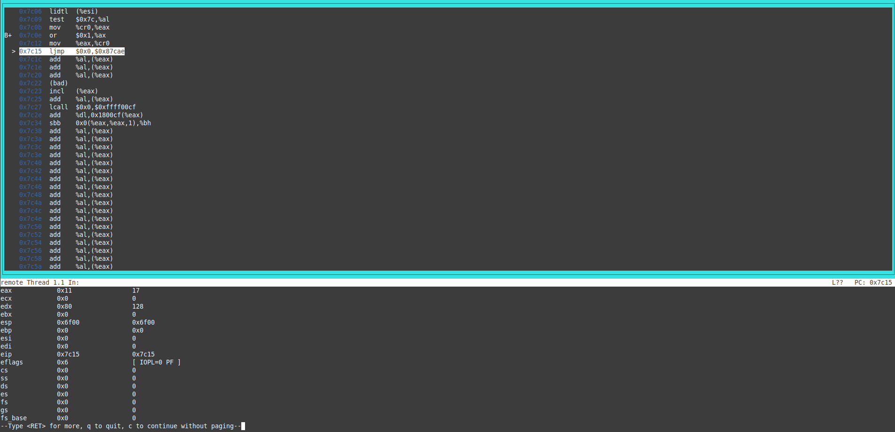
Y luego de la ejecución del jump aparece cargado:
 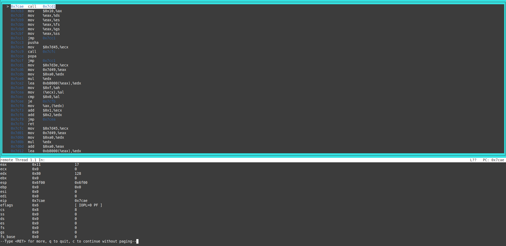
A continuación se cargan uno a uno los segmentos de datos con el registro eax, para finalizar con la carga del stack segment:
 
Se ejecuta la acción y se produce una excepción de GPF que imprime un mensaje. La excepción se produce ya que no se puede definir al registro de segmento de stack como solo lectura debido a que las operaciones de stack (push, pull, etc) requieren tener la capacidad de escribir en el segmento.
Finalmente vemos como el código no completó la acción de cargar al registro:
 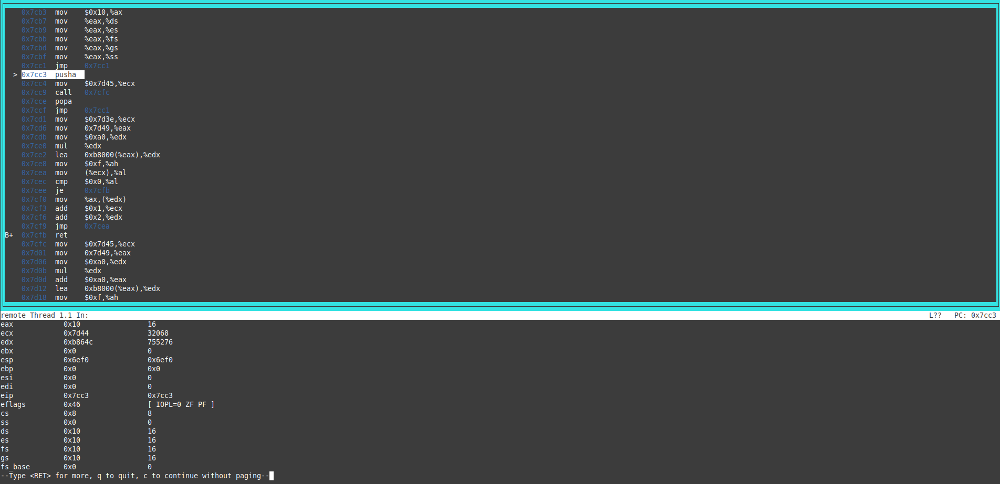

Luego se vuelve a realizar todo la secuencia de acciones pero habiendo definido al descriptor de segmento como lectura y escritura:
Nuevamente se ejecuta la operacion ljmp:
 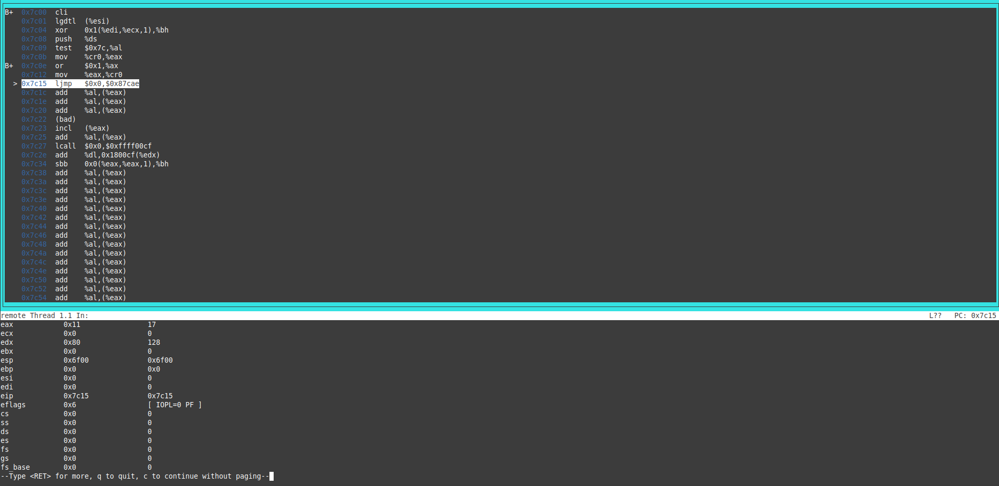
Y vemos como se carga el registro cs:
 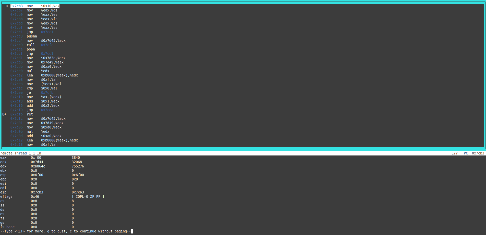
Se realiza nuevamente la carga de todos los segmentos, dejando como último la carga del ss:
 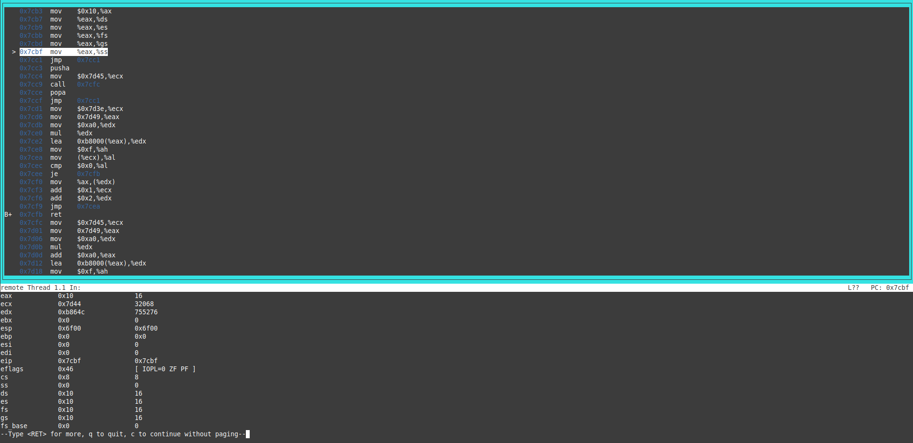
En este caso vemos como la operación pudo realizarse con éxito sin dar lugar a una excepción:
 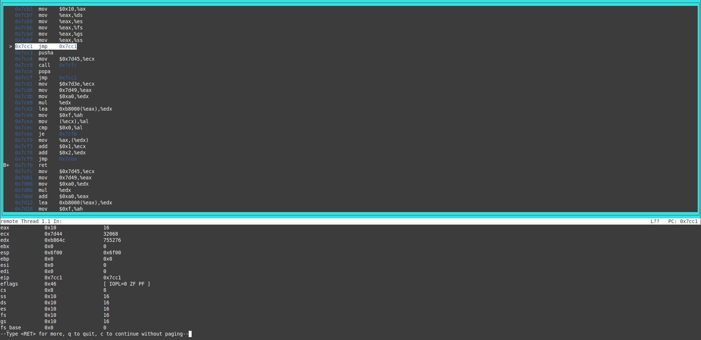

### Inicialización de segmentos 

Una vez que estamos en modo protegido los registros de segmento se cargan con el valor de DATA_SEG (valor arbitrario), ya que, con estas directivas se logra actualizar el caché del descriptor, utilizado por el procesador para ahorrarse consultas a la GDT (Global Descriptor Table).
```c
    mov $DATA_SEG, %ax /*cargamos en ax el valor de DATA_SEG y se lo cargamos a todos los registros de segmentos */
    mov %ax, %ds
    mov %ax, %es
    mov %ax, %fs
    mov %ax, %gs
    mov %ax, %ss
```
Cuando se setea el data segment en solo lectura, esta accion genera una GPF, ya que solo segmentos de datos escribibles pueden ser cargados en registros de pila.


